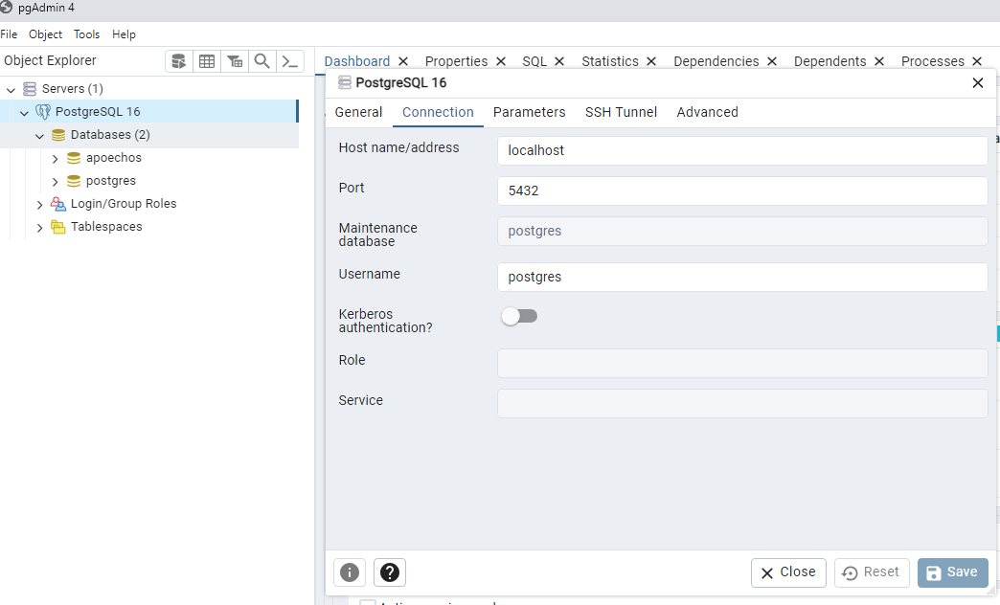

## Download Python
### `https://www.python.org/downloads/`

## Create Virtual Enviroment
### `py -m vevn env`

## Run Virtual Reality
### `env\Scripts\activate.bat`

## Install Django on VE (Virtual Enviroment)
### `pip install django`

## Install Django Rest Framework
### `pip install djangorestframework`

## Download PostgreSQL
### `https://www.enterprisedb.com/downloads/postgres-postgresql-downloads`

### `pip install --upgrade djangorestframework-simplejwt`
### `pip install django-cors-headers`
### `pip install psycopg2`
### `python -m pip install Pillow`

### Create 'static' folder on top level

# Settings.py
### 

DATABASES = {

    'default': {
        'ENGINE': 'django.db.backends.postgresql_psycopg2',
        'NAME': 'apoechos',
        'USER': 'postgres',
        'PASSWORD': '3276',
        'HOST': 'localhost',
        'PORT': '5432',
    }

}

# Apply Migrations (Create databases)
### `python manage.py migrate`

# Run Server
### `python manage.py runserver`

### update requirements.txt
`pip freeze > requirements.txt`

### Docker 
# 1. Create docker image -> docker-compose build 

# 2. Create api and db container -> docker-compose up
# 3. Migrate -> docker-compose run web python manage.py migrate
